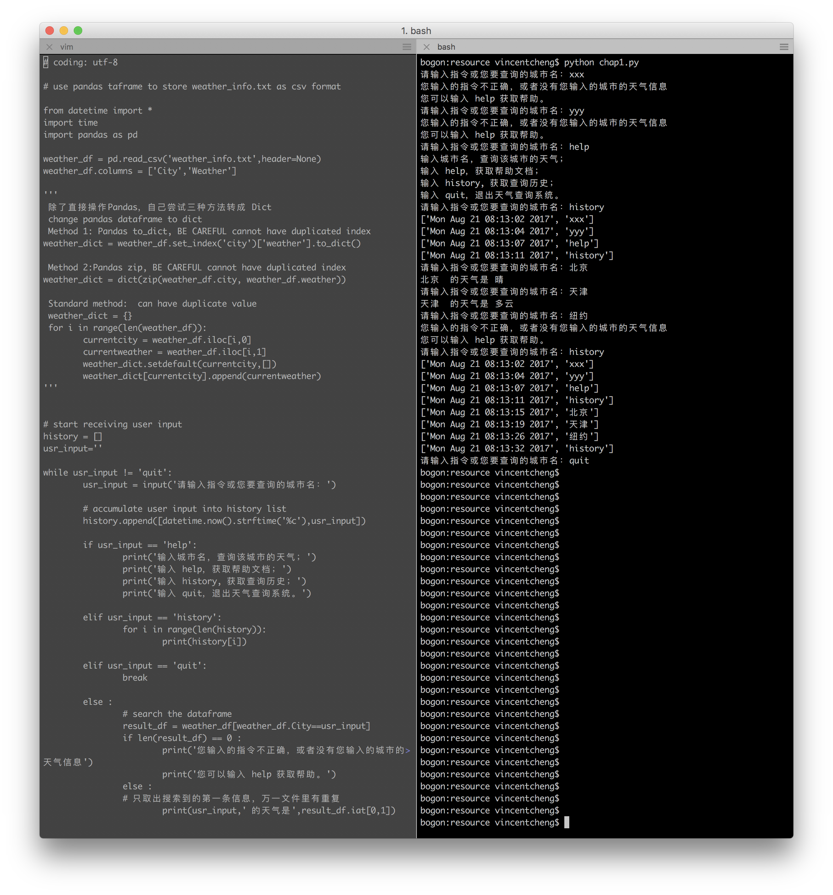

[代码位置](https://github.com/wchengvincent/Py101-004.git)

#### 成果截图

### 学习 Pandas dataframe 数据类型

搜索读取CSV文件的时候发现一个叫做Pandas的库，发现有个Dataframe的数据类型。
Dataframes 和SQL数据库的数据表很像，可以有各种针对表的查询，修改等操作，非常好用。
本来想用List或者Dict，不过这个貌似更有趣。
暂时没有研究Dataframes的执行效率是否反而会慢过Dict

## 不慎堕入大坑！！关于针对List的赋值和变量的有效范围

在实现 history 的时候，我使用了以前学过其他语言编程时候的方法， 例如：

histotry = []
在 while 循环里：
        userinput = input()
        history = history.append(userinput)
        还试过：
         history += userinput
         还有：
         history = history + userinput

 
 以上自己以为OK的写法统统都报错，搞了很久都不得其解，因为这种写法应该是很常见不应该会错的。
 
 后来我怀疑是不是没有把history定义成Global的全局变量的原因，于是网上再找找相关信息。
 **结果找到了一篇写的非常好的一篇文章，而结论完全出乎意料：**
 [python基础（5）：深入理解 python 中的赋值、引用、拷贝、作用域](https://my.oschina.net/leejun2005/blog/145911)
 
 原来python没有为变量赋值的概念，在python里定义的变量的名字只是一个指针。
 另外针对不可变的对象例如整数，字符串等，“=” 的功能是个 rebinding 重新指向新的的数据位置的这么个动作，并不是传统意义的重新赋值。
 而针对可变对象例如List，Dict，这些可变对象，执行.append .extend 则是改变原来对象的内容的动作，原来的对象的位置并没有改变
 **另外在我在循环里执行 history = history.append(user_input) 这种操作的时候，系统会报错说history 是空的对象，没有.append这个方法。 但是我明明定义了history是个List， 还专门在循环外面写了 history=[], 也试过 history = list([]) 。** 后来不用“=” ，直接执行 history.append(user_input)就可以了。看来这个变量在循环里和循环外的没有关联上？？

 恰恰是以上这个特性，影响了变量的作用区域，对于什么时候需要定义Global变量，什么时候不需要，就变得十分重要。
 搞不明白这点的话，就会我这次碰到的困惑。
 
 这篇文章我认为非常关键，因为对于初学python的小伙伴来说，如果不理解关于变量赋值和其作用区域的原理，未来一定还会进坑的。
 
 为了答谢这位作者我还打赏了一块钱给他 :)
 
 
 
 

